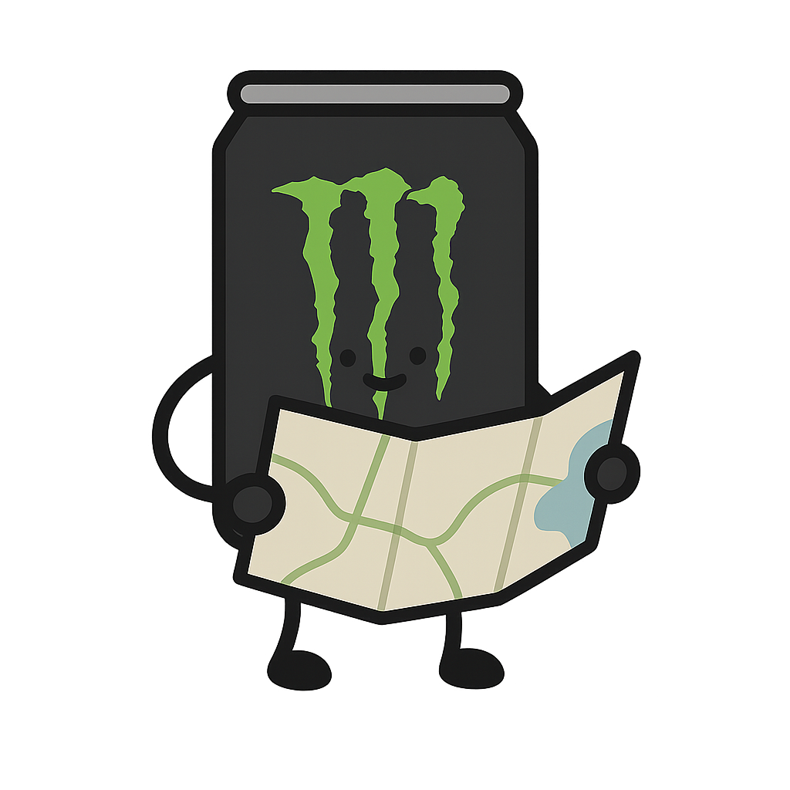
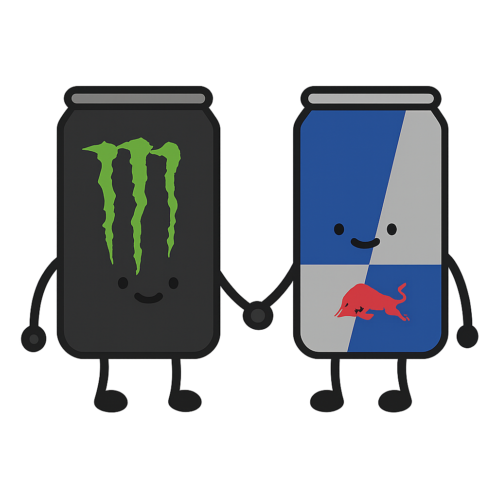

# MonsterFinder
URL = (https://monsterfinder.vmateogm.com/) 

## Introducción
MonsterFinder es una webapp diseñada por V.Mateo GM, como proyecto para solventar el
problema económico que genera la adicción a las energéticas en su grupo de amigos. En
MonsterFinder podrás encontrar las Monster Energy mas baratas en tu zona o tiendas que
frecuentas.

## Lógica
Se plantea que el usuario sea el que añada las tiendas y actualice tanto los productos de
la tienda como los precios para el beneficio común de los usuarios, esto favorece la
escalabilidad mientras que el poder de administración sea limitado.

#### Herramientas
El frontend se ha confeccionado usando Angular, y el Backend con Spring Boot y base de
datos en MySQL.

## Modo de uso

### Iniciar sesión y registrarse
En la esquina superior izquierda hay un botón con el icono de un engranaje (⚙️) que permite registrarse o iniciar sesión.
Una vez iniciada sesión, el usuario podrá ver su nivel y experiencia acumulada, así como acceder a su perfil completo.

### Perfil de usuario
Después de iniciar sesión, aparecerá un botón con tu nivel y nombre de usuario. Al hacer clic, verás tu perfil completo con:
- Nivel y barra de progreso
- Experiencia acumulada y necesaria para el siguiente nivel
- Estadísticas de usuario
- Lista de tiendas favoritas

### Activar ubicación
Arriba a la izquierda del mapa podrás ver un botón con un pin (📍) donde, si clickeas una sola vez, 
te llevará automáticamente a tu ubicación "exacta", donde podrás consultar las tiendas más cercanas.

#### Tiendas cercanas
Una vez se ha activado la ubicacion en tiempo real, podras ver un boton azul abajo a la derecha, con el que
podras mostrar o ocultar las tiendas mas cercanas a ti y la distancia hasta estas.

### Filtrar productos
En la parte superior del mapa encontrarás un botón "Filtrar Monsters" que te permite buscar productos específicos y ordenarlos por precio. Además, puedes filtrar solo por productos disponibles en nevera.

### Añadir tiendas
El mapa tiene un botón arriba a la derecha "Añadir tienda" para agregar nuevas tiendas. Al hacer clic, activarás el modo para añadir tiendas directamente en el mapa. Simplemente:
1. Haz clic en el punto del mapa donde quieres añadir la tienda
2. Introduce el nombre de la tienda
3. Confirma la creación

Al añadir tiendas, ganarás 1000 puntos de experiencia, lo que te ayudará a subir de nivel.

### Configurar productos y precio
Al hacer click en cualquier pin del mapa aparecerá la tienda seleccionada, aquí se mostrarán una vista simple de los productos que tiene la tienda y debajo tres opciones:

- **Editar**: Te permitirá activar o desactivar productos, establecer precios, marcar descuentos y especificar si están disponibles en nevera.
- **Ver Detalles**: Muestra los productos en formato de tarjetas con toda la información.
- **Marcar favoritos**: Las tiendas pueden marcarse como favoritas para acceder rápidamente desde tu perfil.

## Sistema de niveles y experiencia
MonsterFinder incluye un sistema de progresión que recompensa la participación:

- Crear una nueva tienda: +1000 XP
- Añadir un producto a una tienda: +300 XP
- Actualizar precio de un producto: +200 XP
- Verificar una contribución: +100 XP
- Reportar un error: +50 XP

A medida que acumules experiencia, subirás de nivel y verás tu progreso en el perfil.

## Problemas conocidos
Durante el desarrollo de esta pagina se ha encontrado una serie de problemas, que se
espera solventar en futuras actualizaciones: **Spam de tiendas y mal uso de la edición
de estas**: Tanto lo que hace a la pagina escalable como lo que crea su mayor debilidad es
el mal uso intencionado de la creación de tiendas y modificación de los productos. La
solución propuesta es crear usuarios con los que se registra su uso de la pagina, si un
usuario, pongamos, crea 10 tiendas en fila en el mar, se podrá vetar la cuenta de este
usuario y automáticamente borrar toda participación de esta en la pagina.

**Futuras Updates**

**Publicación:** 4 de abril  
**Futuras Actualizaciones:** TBD  

---

### Abril-Mayo
- ✅ Añadir Geolocalización
- ✅ Filtros por rango de productos
- ✅ Más Productos
- ✅ Productos en nevera
- ✅ Usuarios y sistema de autenticación
- ✅ Sistema de experiencia y niveles
- ✅ Sistema de tiendas favoritas
- ✅ Notificaciones visuales de experiencia ganada

### Mayo-Junio (Planificadas)
- Web Scraping para obtener productos live
- Mejorar estética
- Fotos de los productos mejores
- Optimización
- Seguridad

### Junio-??? (Futuras)
- ElasticSearch en el backend
- Overhaul de la página
- Adición de otro tipo de productos
- Overhaul de la página  
- Adición de otro tipo de productos  
=======
